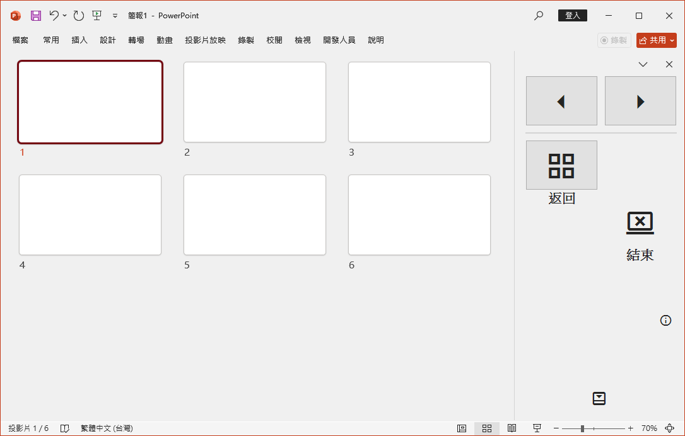
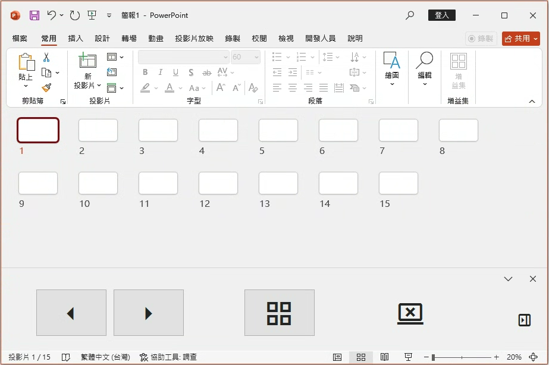

🎉 Shout Out to Notepad++ v8.8.3 release: self-signed certificate!🛠️✨

---

What is PowerPoint Slide Thumbnails Add-in?
-------------------------------------------
Keep slide thumbnails always visible in Presenter View  
投影片縮圖在簡報者檢視中常駐

Screenshot
----------

  
  

Code Signing Certificate
------------------------
- **Name:** github\m00291
- **Serial Number:** 6B2832FA1A8D169444C30BC7AAA68497
- **Fingerprint:** 7BC7CDB061B05A107B1DBB432743FD5594283D11
- **Created:** 2025-08-01
- **Expires:** 2030-08-01

PowerPoint 投影片縮圖插件
-----------------------
**版本：** 1.2.0  
**GitHub：** https://github.com/m00291/PowerPointSlideThumbnailsAddIn

簡介
----
新版 PowerPoint（2013 及之後版本）將經典 2003 簡報者檢視中的常駐投影片縮圖，改為暫時性縮圖格，導致需要額外點擊操作，且在跳轉投影片後會自動關閉。PowerPoint 投影片縮圖插件 透過使用投影片瀏覽模式（Slide Sorter View），讓您能夠隨時保持投影片縮圖可見。安裝插件後，您只需點擊任一縮圖，即可立即跳至該投影片，大幅提升簡報操作的便利性。

移除插件
-------
若要移除插件，請依下列步驟操作：
1. 開啟 **控制台 > 程式和功能**。
2. 在列表中找到 **PowerPoint Slide Thumbnails Add-in**。
3. 點擊 **解除安裝** 並依照指示完成移除。

技術支援
-------
若有任何問題或建議，歡迎於 [討論區](https://github.com/m00291/PowerPointSlideThumbnailsAddIn/discussions) 發表。

---
---

PowerPoint Slide Thumbnails Add-in
----------------------------------
**Version:** 1.2.0  
**GitHub:** https://github.com/m00291/PowerPointSlideThumbnailsAddIn

Overview
--------
Modern versions of PowerPoint (2013 and later) replaced the classic 2003 Presenter View's always-visible slide thumbnails with a temporary grid, requiring extra clicks to navigate and automatically closing after a slide jump. The **PowerPoint Slide Thumbnails Add-in** restores the classic workflow by using the Slide Sorter View, allowing you to keep slide thumbnails visible at all times. With this add-in, you can instantly jump to any slide simply by clicking its thumbnail, streamlining slide navigation during your presentations.

Uninstallation
--------------
To remove the add-in:
1. Open **Control Panel > Programs and Features**.
2. Locate **PowerPoint Slide Thumbnails Add-in** in the list.
3. Click **Uninstall** and follow the prompts.

Support
-------
For questions and feedback, please use the [Discussions](https://github.com/m00291/PowerPointSlideThumbnailsAddIn/discussions) section.
